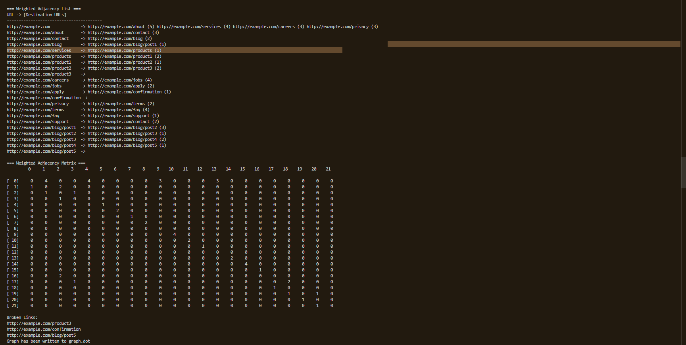
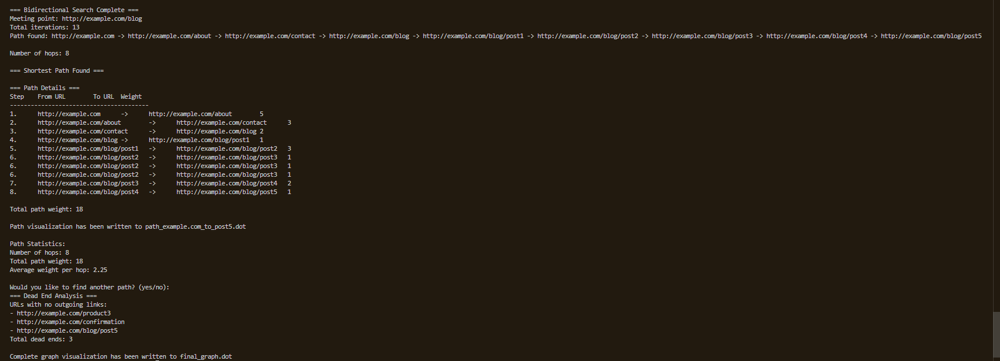

# DSA Algorithms: Edmonds-Karp & Bidirectional Search

## Project Description

This project demonstrates two powerful graph algorithms used in **Data Structures and Algorithms (DSA)**:

1. **Edmonds-Karp Algorithm**: A specific implementation of the **Ford-Fulkerson method** using **Breadth-First Search (BFS)** to compute the **maximum flow** in a flow network.
2. **Bidirectional Search Algorithm**: An optimization of traditional BFS/DFS to search from both start and goal nodes simultaneously, significantly reducing search time in large graphs.

These algorithms are essential in areas like **network design, routing, AI pathfinding, and graph theory applications**.

---

## Learning Objectives

- Understand **flow networks** and the concept of **maximum flow**.
- Implement **BFS** based approaches to solve complex graph problems.
- Analyze time and space complexity of both **Edmonds-Karp** and **Bidirectional Search**.
- Visualize how **residual graphs** and **simultaneous searches** work.

---

## Algorithms Overview

### 1. Edmonds-Karp Algorithm

- Utilizes **BFS** to find augmenting paths.
- Maintains a **residual graph** to track unused capacities.
- Repeats until **no more augmenting paths** exist.
- Time complexity: **O(VE²)**

### 2. Bidirectional Search

- Runs **two simultaneous BFS**: one from the source and one from the goal.
- Stops when the two searches **intersect**.
- Significantly faster in many practical cases.
- Time complexity: **O(b^(d/2))**, where b = branching factor, d = distance between nodes.

---

##  Technologies Used

| Component      | Technology     |
|----------------|----------------|
| Programming    | C++ / Python    |
| Algorithms     | BFS, Graphs     |
| IDE            | VS Code / CodeBlocks / PyCharm |
| Input Format   | Adjacency Matrix or List |
| Output         | Console / File |

---
## Edmund and Bidirectional Outputs

